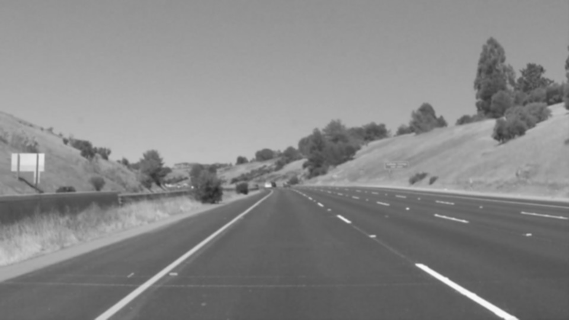
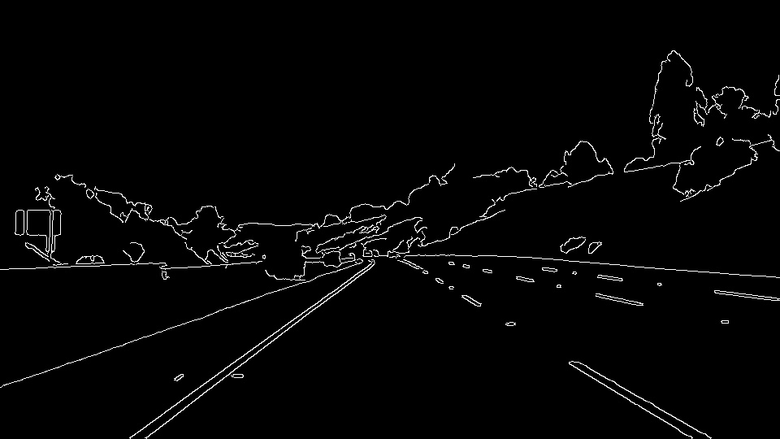
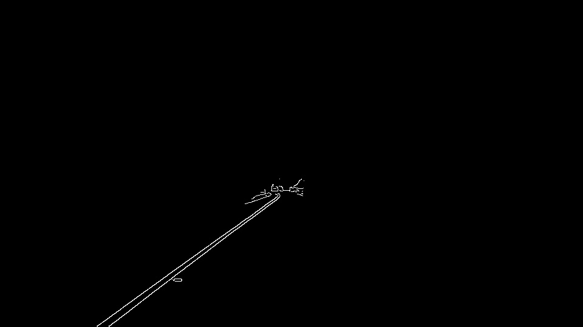
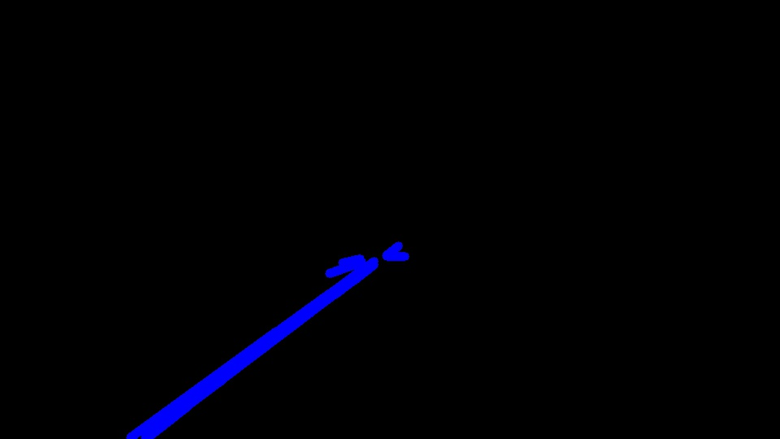
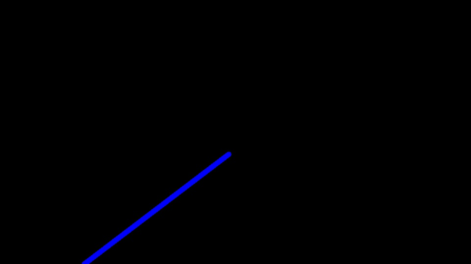
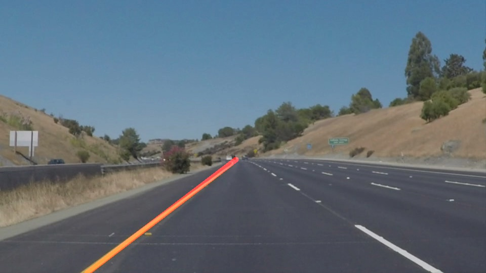

# **Finding Lane Lines on the Road**

## Finding Lane Lines on the Road

The goals / steps of this project are the following:

* Make a pipeline that finds lane lines on the road
* Reflect on your work in a written report

---

### Reflection

### 1. Describe your pipeline.

My pipeline contains the following steps:

* Gray-scaling the image, this is used as input for the of Gaussian Blur function.

```python
def grayscale(img):
    """Applies the Grayscale transform
    This will return an image with only one color channel
    but NOTE: to see the returned image as grayscale
    (assuming your grayscaled image is called 'gray')
    you should call plt.imshow(gray, cmap='gray')"""
    return cv2.cvtColor(img, cv2.COLOR_RGB2GRAY)
```


* Used the gaussian blur to soften small edges. The output of this function will be used by Canny. For the gaussian blur the kernel size of `5` is used.

```python
def gaussian_blur(img, kernel_size):
    """Applies a Gaussian Noise kernel"""
    return cv2.GaussianBlur(img, (kernel_size, kernel_size), 0)
```



* Then find the edges taking advantage of the Canny function. The canny min threshold was 50 and the max threshold was 150.

```python
def canny(img, low_threshold, high_threshold):
    """Applies the Canny transform"""
    return cv2.Canny(img, low_threshold, high_threshold)
```


* After having the edges detected, the interest region should be found. Because for all the images two lane line one in left and the other in right should be found, I decided to create two interest regions, one in left side of the image to the middle. The other from the middle to the right side of the image. Both these regions are feed to the Hough transfer to find the lines in left and right.

```python

def get_left_region_of_interest(image):
    """
    Returns the left region of interest for the given image.
    Create a region in middle left of the given image.
    
    Args:
        image: The image array or PIL image
        
    Returns:
        vertices: The points that contain the vertices.
    """
    imshape = image.shape
    left_point =  (imshape[1]/8, imshape[0])
    right_point = (imshape[1]/2, imshape[0])
    apex1 = (imshape[1]/2 - 20, imshape[0]/2 +25)
    apex2 = (imshape[1]/2 + 20, imshape[0]/2 +25)
    vertices = np.array([[left_point, apex1, apex2, right_point]], dtype=np.int32)
    return vertices

def get_right_region_of_interest(image):
    """
    Returns the left region of interest for the given image.
    Creates a region in middle right of the given image.
    
    Args:
        image: The image array or PIL image
        
    Returns:
        vertices: The points that contain the vertices.
    """
    imshape = image.shape
    right_point =  (imshape[1],imshape[0])
    left_point = (imshape[1]/2,imshape[0])
    apex1 = (imshape[1]/2 -20, imshape[0]/2 +25)
    apex2 = (imshape[1]/2 + 20, imshape[0]/2 +25)
    vertices = np.array([[left_point, apex1, apex2, right_point]], dtype=np.int32)
    return vertices

def region_of_interest(img, vertices):
    """
    Applies an image mask.
    
    Only keeps the region of the image defined by the polygon
    formed from `vertices`. The rest of the image is set to black.
    `vertices` should be a numpy array of integer points.
    """
    #defining a blank mask to start with
    mask = np.zeros_like(img)   
    
    #defining a 3 channel or 1 channel color to fill the mask with depending on the input image
    if len(img.shape) > 2:
        channel_count = img.shape[2]  # i.e. 3 or 4 depending on your image
        ignore_mask_color = (255,) * channel_count
    else:
        ignore_mask_color = 255
        
    #filling pixels inside the polygon defined by "vertices" with the fill color    
    cv2.fillPoly(mask, vertices, ignore_mask_color)
    
    #returning the image only where mask pixels are nonzero
    masked_image = cv2.bitwise_and(img, mask)
    return masked_image
```



* The found region of interest are feed to the Hough transform, separately and the result is used in the extrapolation function. For the hough lines calculation, the threshold is set to `20`, maximum line gap is `5`, minimum line length is `15`, rho is `1` and theta is `1` degree.

```python
def draw_hough_lines(img, rho, theta, threshold, min_line_len, max_line_gap, color=[255, 0, 0], thickness=2):
    """
    `img` should be the output of a Canny transform.
        
    Returns an image with hough lines drawn.
    """
    lines = get_hough_lines(img, rho, theta, threshold, min_line_len, max_line_gap)
    #lines = calculate_line_extrapolations(lines, img)
    line_img = np.zeros((img.shape[0], img.shape[1], 3), dtype=np.uint8)
    draw_lines(line_img, lines, color, thickness)
    return line_img

def get_hough_lines(img, rho, theta, threshold, min_line_len, max_line_gap):
    """
    Returns the hough lines for the given image.
    
    Args:
        img: The array like image or PIL image
        rho: The rho parameter for the hough lines
        theta: The theta parameter for the hough lines
        min_line_len: The minimum length of the line
        max_line_gap: The maximum gap between two lines.
    Returns:
        lines: an array including the lines found.
    """
    lines = cv2.HoughLinesP(img, rho, theta, threshold, np.array([]), minLineLength=min_line_len, maxLineGap=max_line_gap)
    return lines
```



* Using middle point of each line and fitting a line to these points, the extrapolation is done. Then to separate `y`s are given to the fitted function, so the x is calculated. It is also checked that the x is inside the image.

```python
def calculate_line_extrapolations(lines, image):
    """
    Calculates the extrapolation for the given lines with very simple rule.
    
    For gaining the function of extrapolation the polyfit is used.
    It is also checked that x1, x2 that are calculated through the extrapolation are
    indeed in the image. Otherwise the image was not usable and no lines are returned.
    
    Args:
        lines: The list of hough lines to be extrapolated in single line
        image: The array like Image or PIL image
        
    Returns:
        lines
    """
    imshape = image.shape;
    middle_points_x = []
    middle_points_y = []
    for line in lines:
        x, y = calculate_middle_point(line)
        middle_points_x.append(x)
        middle_points_y.append(y)
    if len(middle_points_x) > 0 and len(middle_points_y) > 0:
        m, b = np.polyfit(middle_points_x, middle_points_y, 1)
        y1 = imshape[0]
        y2 = imshape[0]/2 +45 
        x1 = (y1 - b)/m
        x2 = (y2 - b)/m
        line = [int(x1), int(y1), int(x2), int(y2)]
        if x1 <= imshape[1] and x1 >= 0 and x2 <=imshape[1] and x2>=0:
            lines = [[line]]
            return lines
    return [False]

def calculate_middle_point(line):
    """
    Calculates the middle point of the given line.
    
    Args:
        line: The array that contains the lines x1,x2,y1,y2
        
    Returns: 
        The middle point of the given line as list
    """
    for x1,y1,x2,y2 in line:
        xM = (x1 + x2)/2
        yM = (y1 + y2)/2
        return [xM, yM]
```



* Having to points, the extrapolation line is drawn on the image. For the video, this process is repeated for every frame.

```python
def weighted_img(img, initial_img, α=0.8, β=1., γ=0.):
    """
    `img` is the output of the hough_lines(), An image with lines drawn on it.
    Should be a blank image (all black) with lines drawn on it.
    
    `initial_img` should be the image before any processing.
    
    The result image is computed as follows:
    
    initial_img * α + img * β + γ
    NOTE: initial_img and img must be the same shape!
    """
    return cv2.addWeighted(initial_img, α, img, β, γ)
```



### 2. Identify potential shortcomings with your current pipeline

* One potential shortcoming is the working with the low contrast images. In this images it is hard to find lane line or find them reasonably.

* Another potential problem would be reflection from the cars in front, It would be a white spot in the picture and mix with the lane lines.

* When the lane lines are not drawn correctly or are changed for temporary street repairs. This pipeline does not handle irregular lane lines.

* For very steep curves it is hard to find the lane lines. The region of interest should be smaller, and this should be done dynamically.

* Shadows on the road make the lane line detection much harder.

### 3. Suggest possible improvements to your pipeline

* A possible improvement would be using the vanishing point to find the interest region in the the image. This could be advantage for all kind of roads.

* Using different color spaces, other than RGB could be advantageous, specially working with low contrast images or images with shadows.